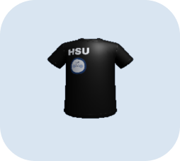
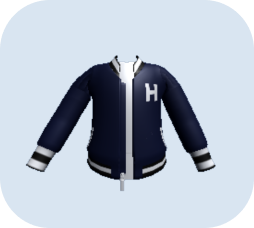
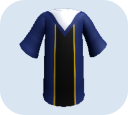

# Benefit

### 작품 개요
요즘 온라인 쇼핑몰 사이트를 보면, 자신이 원하는 옷(티셔츠, 바지) 들을 함께 입었을 때 어울리는지 확인해 볼 수 있는 서비스를 제공한다. 이 기능은 내가 고른 옷들을 함께 입어보았을 때 어울리는 조합인지 확인해 볼 수 있어 매우 유용하다. 그러나, 자신의 신체에 직접 대조해보지 못하고 옷 사진만 나란히 붙여 보여주기 때문에 조합해 본 옷들이 나와 어울리는지는 확인할 수 없다는 단점이 존재한다. 이 때문에 사람들은 인터넷 사이트에서 옷을 구매해 배송받은 후에야 자신과 어울리지 않는다는 것을 확인하게 되어 반품하거나 옷을 구매해놓고 입지 않는 경우가 발생한다. 이 점을 보완하여 옷들을 직접 착용한 자신의 모습을 카메라로 확인할 수 있는 가상 피팅 서비스를 만들고자 한다.

1. 누구나 어디서든 원하는 대로 옷을 가상으로 입어보고 코디해볼 수 있다.  
2. 옷을 착용한 자신의 모습을 캡쳐하여 원하는 이메일 주소로 전송할 수 있다.   
3. 사용자가 가장 많이 입어 본 옷의 데이터를 기반으로 실제 쇼핑몰 사이트를 추천해준다.

 
 

### 사용 순서

#### 1. 첫 화면
- 날씨 보러 가기
- 옷 입으러 가기
#### 2-1. 날씨 확인
- 지역 입력
- 오늘부터 4일 후 날씨까지 확인가능
- 오늘의 날씨 확인 (ex. 소나기)
#### 2-2. 옷 선택 및 착용
- 날씨에 따른 옷 필터링
- 옷 색상 선택
- 원하는 종류의 옷 착용 하기 (상의, 하의, 원피스 등등..)
#### 3. 캡쳐하기
- 옷을 착용한 자신의 모습 촬영
- yes 클릭 시 메일 전송 화면으로 이동
- no 클릭 시 저장 및 메일 전송 스킵
- yes/no 버튼 클릭 후 오늘 가장 많이 착용한 옷 확인 가능
#### 4. 메일 전송
- naver 메일만 가능 (naver 메일 smtp를 사용함)
#### 5. 구매 링크
- 오늘 가장 많이 착용한 옷 리스트 나열
- 옷 클릭 시 구매 링크로 이동

 
 

### 주요 적용 기술
- Blender : 옷 제작
- Unity : 화면 제작, C#을 이용한 카메라 렌더링 및 필터링, 화면 캡쳐
- SQLite : 옷 정보에 대한 데이터 베이스 생성, 프로그램 실행시, 사용자의 선호 옷 정보 수집
- OpenWeatherMap API : 지역별 날씨 데이터 수집, 해당 날씨에 대한 옷 추천

 
 

### 옷장

|Benefit|SHIRT|SLEEVELESS|DRESS|SHORT SKIRT|SHORT PANTS|LONG SKIRT|LONG PANTS|
|:---:|:---:|:---:|:---:|:---:|:---:|:---:|:---:|
|**RED**||||||||
|**PINK**||||||||
|**YELLO**||||||||
|**GREEN**||||||||
|**BLUE**||||||||
|**WHITE**||||||||
|**BLACK**||||||||

  
|HANSUNG||||||
|:---:|:---:|:---:|:---:|:---:|:---:|

 
 

### 팀원
<a href="https://github.com/hyeonda02">강다현</a>, <a href="https://github.com/yewon0219">김예원</a>, <a href="https://github.com/
sheepyis">양인서</a>, <a href="https://github.com/0hyujin">오유진</a>

### 지도 교수님
계희원 교수님

